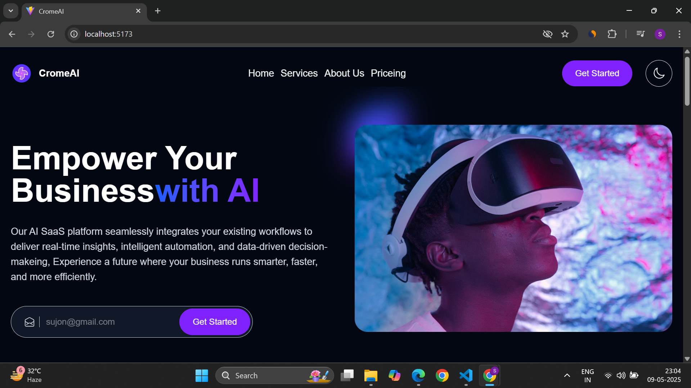
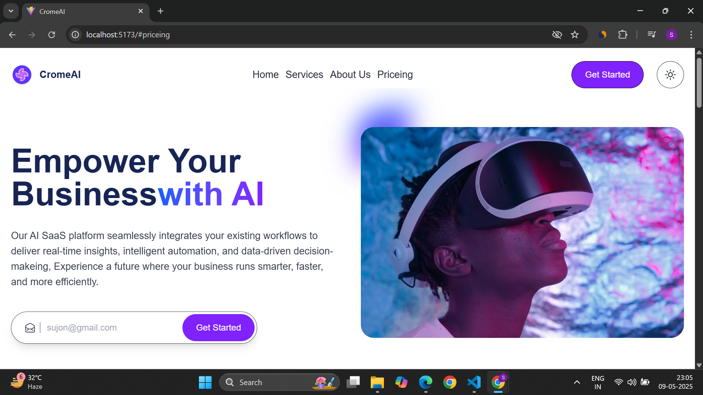
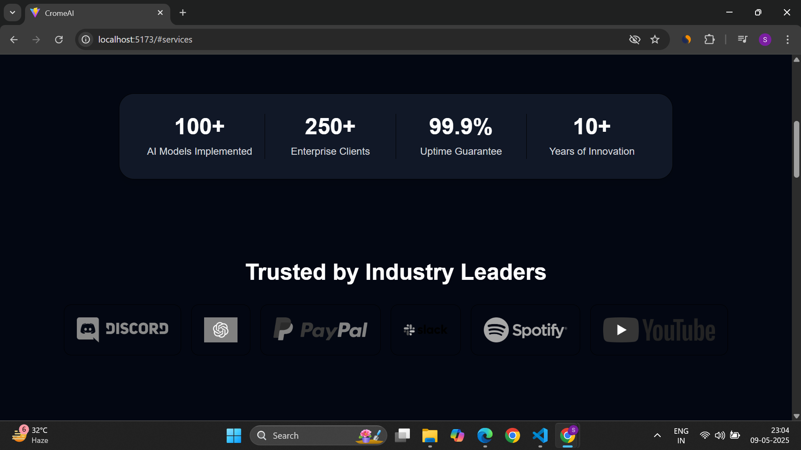
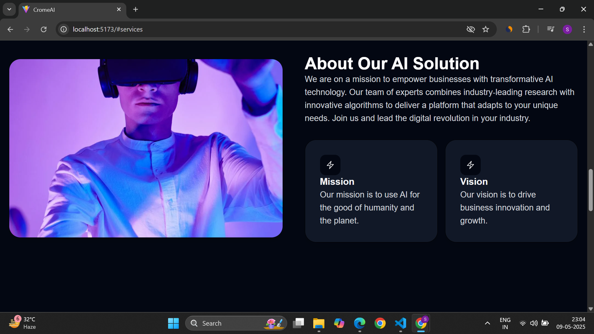
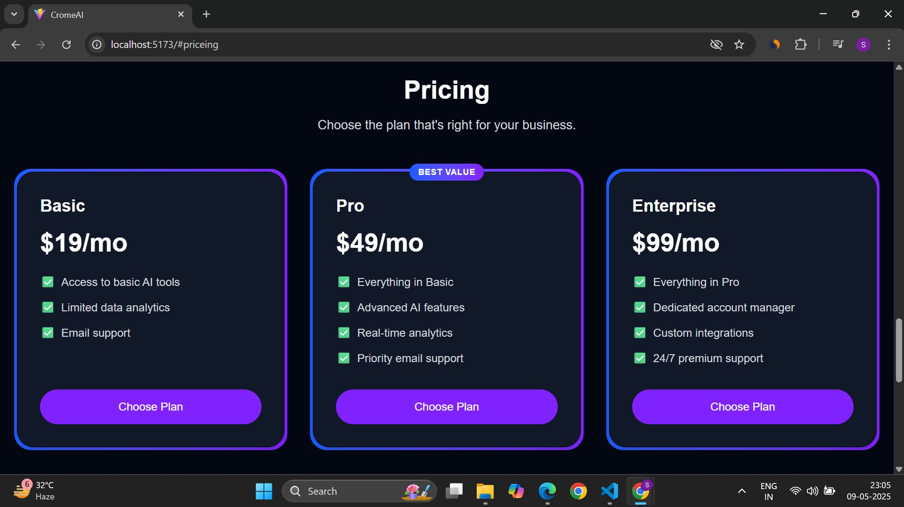

# 🌐 Landing Page with React, TypeScript & Tailwind CSS


> A sleek and responsive landing page built using **React**, **TypeScript**, and **Tailwind CSS**, with light/dark mode support and global state management via **Zustand**.

---

---

## ✨ Features

- 🌗 Toggle between Dark and Light modes
- ⚡ Blazing-fast development with Vite
- 📦 Global state managed with Zustand
- 🎨 Utility-first styling with Tailwind CSS
- 🔐 Strong typing with TypeScript
- 🛠️ Linting with ESLint and React hooks support
- 📱 Fully responsive layout for all devices

---

## 🧱 Tech Stack

| Category       | Tech            |
|----------------|-----------------|
| Framework      | [React](https://reactjs.org) |
| Language       | [TypeScript](https://www.typescriptlang.org) |
| Styling        | [Tailwind CSS](https://tailwindcss.com) |
| State          | [Zustand](https://github.com/pmndrs/zustand) |
| Build Tool     | [Vite](https://vitejs.dev) |
| Linting        | [ESLint](https://eslint.org) |

---

## 🚀 Getting Started

### 1. Clone the Repository

```bash
git clone https://github.com/CODESUJON/Landing_Page_With_React

```bash
npm run dev
```

## 🖼️ Preview

### 🌓 Home (Dark & Light Mode)



---

### 🧾 Sections

#### 🎯 Achievements


#### ℹ️ About


#### 🛠️ Services


#### 💰 Pricing


#### 🔚 Footer


